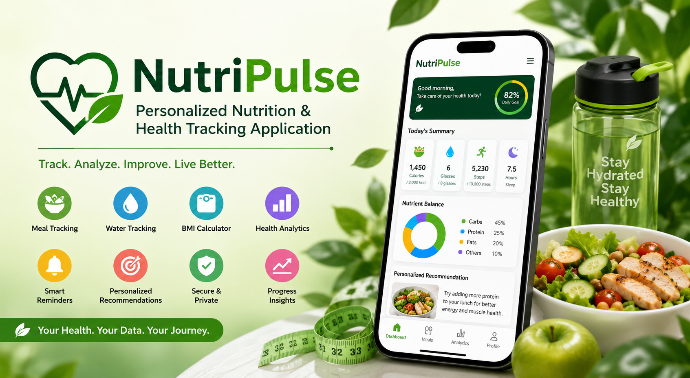

# NutriPulse – Personalized Nutrition and Health Tracking Application



NutriPulse is a full-stack nutrition and health tracking web application designed to help users maintain healthier daily habits. It allows users to track meals, monitor water intake, calculate BMI, view weekly health analytics, and receive personalized wellness recommendations.

The application is especially useful for students, working professionals, homemakers, and health-conscious users who want a simple platform to monitor their nutrition and wellness progress.

---

## Project Overview

Maintaining a balanced diet and healthy lifestyle can be difficult because users often forget to track meals, water intake, calories, and health measurements.

NutriPulse solves this problem by providing a centralized dashboard where users can:

- Record daily meals
- Track calories and macronutrients
- Monitor daily water consumption
- Calculate and save BMI records
- View weekly health analytics
- Receive personalized recommendations
- Manage their health profile and goals

---

## Features

### User Authentication

- User registration
- User login
- Secure password hashing
- JWT-based authentication
- Protected dashboard routes
- Logout functionality

### User Profile

- Update name and personal information
- Select profession
- Add age, gender, height, and weight
- Select health goal
- Select activity level
- Personalized dashboard information

### Meal Tracker

- Add daily meals
- Select meal type
- Record food name and quantity
- Track calories
- Track protein, carbohydrates, and fats
- Add meal notes
- Edit meal records
- Delete meal records
- View total daily nutrition values

### Water Tracker

- Add water intake quickly
- Add custom water amount
- Track daily water goal
- View hydration progress percentage
- View remaining water requirement
- Delete water records

### BMI Calculator

- Calculate BMI using height and weight
- Display BMI category
- Save BMI results
- View BMI history
- Delete BMI records

### Dashboard

- View total calories consumed
- View total water intake
- View number of meals logged
- View latest BMI
- View calorie progress
- View water progress
- View macronutrient summary
- View recent meals
- View personalized recommendations

### Weekly Analytics

- Weekly calorie chart
- Weekly hydration chart
- Daily meal count
- Macronutrient distribution
- BMI activity
- Daily health breakdown
- Interactive charts using Recharts

### Personalized Recommendations

NutriPulse generates wellness recommendations based on:

- User profession
- Health goal
- Activity level
- Water intake
- Meal activity
- Calories consumed
- BMI category
- Nutrition records

> Recommendations are intended for general wellness guidance and do not replace professional medical or dietary advice.

---

## Technology Stack

### Frontend

- React.js
- Vite
- Tailwind CSS
- JavaScript
- React Router
- Axios
- React Icons
- Framer Motion
- Recharts

### Backend

- Node.js
- Express.js
- MongoDB
- Mongoose
- JSON Web Token
- bcryptjs
- CORS
- dotenv

### Development Tools

- Visual Studio Code
- Git
- GitHub
- Postman
- MongoDB Compass
- npm

---

## System Architecture

```text
User
  |
  v
React + Vite Frontend
  |
  | Axios API Requests
  v
Node.js + Express Backend
  |
  | JWT Authentication Middleware
  v
Controllers and Business Logic
  |
  | Mongoose
  v
MongoDB Database
```

---

## Application Workflow

```text
User Registration
       |
       v
User Login
       |
       v
JWT Authentication
       |
       v
Complete User Profile
       |
       v
Access Dashboard
       |
       +-------------------+
       |                   |
       v                   v
Meal Tracker          Water Tracker
       |                   |
       +---------+---------+
                 |
                 v
          BMI Calculator
                 |
                 v
          Weekly Analytics
                 |
                 v
     Personalized Recommendations
```

---

## Project Folder Structure

```text
NutriPulse/
│
├── client/
│   ├── public/
│   │   ├── favicon.svg
│   │   └── hero.png
│   │
│   ├── src/
│   │   ├── api/
│   │   │   └── api.js
│   │   │
│   │   ├── components/
│   │   │   ├── About.jsx
│   │   │   ├── CTA.jsx
│   │   │   ├── DashboardLayout.jsx
│   │   │   ├── FAQ.jsx
│   │   │   ├── Features.jsx
│   │   │   ├── Footer.jsx
│   │   │   ├── HealthTips.jsx
│   │   │   ├── Hero.jsx
│   │   │   ├── Navbar.jsx
│   │   │   ├── ProtectedRoute.jsx
│   │   │   ├── Recommendations.jsx
│   │   │   ├── Sidebar.jsx
│   │   │   ├── Statistics.jsx
│   │   │   ├── Testimonials.jsx
│   │   │   └── Topbar.jsx
│   │   │
│   │   ├── context/
│   │   │   ├── AuthContext.jsx
│   │   │   └── AuthProvider.jsx
│   │   │
│   │   ├── hooks/
│   │   │   └── useAuth.js
│   │   │
│   │   ├── pages/
│   │   │   ├── Analytics.jsx
│   │   │   ├── BmiCalculator.jsx
│   │   │   ├── Dashboard.jsx
│   │   │   ├── Home.jsx
│   │   │   ├── Login.jsx
│   │   │   ├── MealTracker.jsx
│   │   │   ├── Profile.jsx
│   │   │   ├── Register.jsx
│   │   │   └── WaterTracker.jsx
│   │   │
│   │   ├── App.jsx
│   │   ├── index.css
│   │   └── main.jsx
│   │
│   ├── .env.example
│   ├── package.json
│   ├── package-lock.json
│   ├── postcss.config.js
│   ├── tailwind.config.js
│   └── vite.config.js
│
├── server/
│   ├── config/
│   ├── controllers/
│   ├── middleware/
│   ├── models/
│   ├── routes/
│   ├── .env.example
│   ├── package.json
│   ├── package-lock.json
│   └── server.js
│
├── docs/
├── screenshots/
├── .gitignore
└── README.md
```

---

## Installation and Setup

### Prerequisites

Install the following software before running the project:

- Node.js
- npm
- MongoDB or MongoDB Atlas
- Git
- Visual Studio Code

---

## Clone the Repository

```bash
git clone YOUR_GITHUB_REPOSITORY_URL
```

Move into the project folder:

```bash
cd NutriPulse
```

---

## Backend Setup

Open a terminal inside the server folder:

```bash
cd server
```

Install backend dependencies:

```bash
npm install
```

Create a `.env` file inside the `server` folder:

```env
PORT=5000
MONGO_URI=your_mongodb_connection_string
JWT_SECRET=your_secure_jwt_secret
```

Start the backend server:

```bash
npm run dev
```

If the `dev` command is not available, use:

```bash
node server.js
```

The backend should run on:

```text
http://localhost:5000
```

---

## Frontend Setup

Open another terminal:

```bash
cd client
```

Install frontend dependencies:

```bash
npm install
```

Create a `.env` file inside the `client` folder:

```env
VITE_API_URL=http://localhost:5000/api
```

Start the frontend:

```bash
npm run dev
```

The frontend should run on:

```text
http://localhost:5174
```

---

## Backend CORS Configuration

The backend must allow requests from the frontend URL:

```javascript
const allowedOrigins = [
  "http://localhost:5173",
  "http://localhost:5174",
];

app.use(
  cors({
    origin: allowedOrigins,
    credentials: true,
  })
);
```

---

## API Endpoints

### Authentication

| Method | Endpoint | Description |
|---|---|---|
| POST | `/api/auth/register` | Register a new user |
| POST | `/api/auth/login` | Login user |
| GET | `/api/auth/me` | Get current authenticated user |

### Profile

| Method | Endpoint | Description |
|---|---|---|
| GET | `/api/profile` | Get user profile |
| PUT | `/api/profile` | Update user profile |

### Meals

| Method | Endpoint | Description |
|---|---|---|
| GET | `/api/meals` | Get meal records |
| POST | `/api/meals` | Add a new meal |
| PUT | `/api/meals/:id` | Update a meal |
| DELETE | `/api/meals/:id` | Delete a meal |

### Water

| Method | Endpoint | Description |
|---|---|---|
| GET | `/api/water` | Get water records |
| POST | `/api/water` | Add water intake |
| DELETE | `/api/water/:id` | Delete a water record |

### BMI

| Method | Endpoint | Description |
|---|---|---|
| GET | `/api/bmi` | Get BMI history |
| POST | `/api/bmi` | Calculate and save BMI |
| DELETE | `/api/bmi/:id` | Delete a BMI record |

### Dashboard and Analytics

| Method | Endpoint | Description |
|---|---|---|
| GET | `/api/dashboard` | Get dashboard summary |
| GET | `/api/analytics/weekly` | Get weekly analytics |

---

## Environment Variables

Real environment files must not be uploaded to GitHub.

The following files should remain private:

```text
client/.env
server/.env
```

Safe example files may be uploaded:

### `client/.env.example`

```env
VITE_API_URL=http://localhost:5000/api
```

### `server/.env.example`

```env
PORT=5000
MONGO_URI=your_mongodb_connection_string
JWT_SECRET=your_secure_jwt_secret
```

---

## Git Ignore Configuration

The main `.gitignore` should contain:

```gitignore
node_modules/
client/node_modules/
server/node_modules/

.env
client/.env
server/.env

dist/
client/dist/
server/dist/

*.log
.vscode/
.idea/
.DS_Store
Thumbs.db
```

---

## Screenshots

### Landing Page


---

## Team Members

| Name | Role |
|---|---|
| Polimera Girija | Team Lead and Backend Developer |
| Kulasri Durga Deepika Bora | Frontend Developer |

---

## Team Responsibilities

### Polimera Girija

- Backend architecture
- Express server setup
- MongoDB database integration
- Authentication APIs
- Meal, water, BMI, dashboard, and analytics APIs
- JWT middleware
- Backend testing

### Kulasri Durga Deepika Bora

- Frontend architecture
- Landing page development
- Login and registration interfaces
- Dashboard user interface
- Meal Tracker interface
- Water Tracker interface
- BMI Calculator interface
- Analytics charts
- Profile interface
- API integration
- Responsive design

---

## Future Enhancements

- Email and push notifications
- Meal reminders
- Water reminder alerts
- AI-powered nutrition recommendations
- Food image recognition
- Barcode scanning
- Nutrition database integration
- Grocery list generation
- Recipe recommendations
- Appointment booking with nutrition professionals
- Mobile application
- Cloud deployment
- PDF health report generation
- Dark mode

---

## Security Features

- Password hashing using bcryptjs
- JWT authentication
- Protected API routes
- Protected frontend routes
- Environment variable protection
- User-specific database records
- Input validation
- Secure MongoDB connection

---

## Testing

The application can be tested using:

- Browser developer tools
- Postman
- MongoDB Compass
- React frontend forms
- API response validation
- Authentication and protected-route testing

Run the frontend production build test:

```bash
cd client
npm run build
```

---

## Known Limitations

- Recommendations are rule-based rather than AI-generated
- Nutrition values are entered manually
- Reminder notifications are not yet implemented
- The project currently depends on the backend being available on port `5000`
- Health recommendations are for general informational purposes only

---

## Disclaimer

NutriPulse is an educational health tracking application.

The BMI results, health suggestions, nutrition information, and recommendations provided by this application are intended for general wellness guidance only. They should not be considered medical diagnosis, treatment, or professional dietary advice.

Users should consult qualified healthcare professionals for medical or nutrition-related concerns.

---

## Contribution

Contributions and improvements are welcome.

1. Fork the repository
2. Create a new branch

```bash
git checkout -b feature-name
```

3. Make the required changes
4. Commit the changes

```bash
git commit -m "Add new feature"
```

5. Push the branch

```bash
git push origin feature-name
```

6. Create a pull request

---

## License

This project is licensed under the MIT License.

---

## Acknowledgements

- SmartBridge
- MongoDB
- React
- Node.js
- Express.js
- Tailwind CSS
- Recharts
- Open-source development community

---

## Project Status

NutriPulse is currently under active development.

Core modules completed:

- Authentication
- Profile management
- Meal tracking
- Water tracking
- BMI calculation
- Dashboard
- Weekly analytics
- Personalized recommendations

---

## Contact

For project-related queries:

**Kulasri Durga Deepika Bora**

- GitHub: [kulasrireddy](https://github.com/kulasrireddy)
- Role: Frontend Developer

---

⭐ If you find this project useful, consider giving the repository a star.
